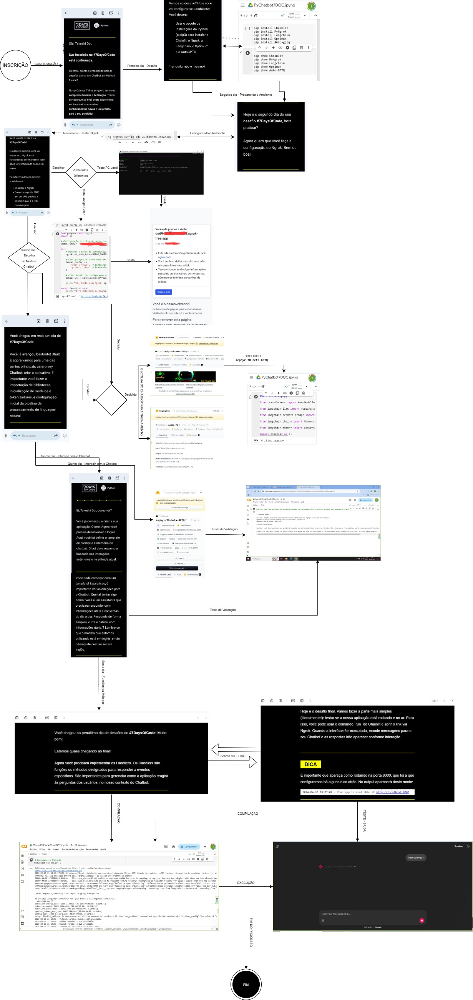

# 🤖 7DaysOfCode: Chatbot com LLM  

[](https://colab.research.google.com/github/Takdoi/desenvolvimento/blob/main/7daysOfCodeChatBOT.ipynb)  

Chatbot desenvolvido no desafio #7DaysOfCode usando **Hugging Face Transformers** e **Google Colab com GPU A100**.  

## 📊 Fluxograma  
  

## 🛠️ Tecnologias  
- **Python 3.10+**  
- **Hugging Face Transformers** (Modelo: `facebook/blenderbot-400M-distill`)  
- **Google Colab** (GPU A100 para aceleração)  
- **Jupyter Notebook**  

## 🚀 Como Usar (Recomendado: Colab)  
1. **Acesse o notebook diretamente no Colab**:  
   → [Link para o Notebook](https://colab.research.google.com/github/Takdoi/desenvolvimento/blob/main/7daysOfCodeChatBOT.ipynb)  
2. **Execute as células em ordem**:  
   - A primeira instala `transformers` e `torch`.  
   - A segunda carrega o modelo.  
   - A terceira inicia o chat interativo.  

💡 **Para execução local** (não recomendado sem GPU):  
```bash
git clone https://github.com/Takdoi/desenvolvimento.git
pip install -r requirements.txt
jupyter notebook 7daysOfCodeChatBOT.ipynb
